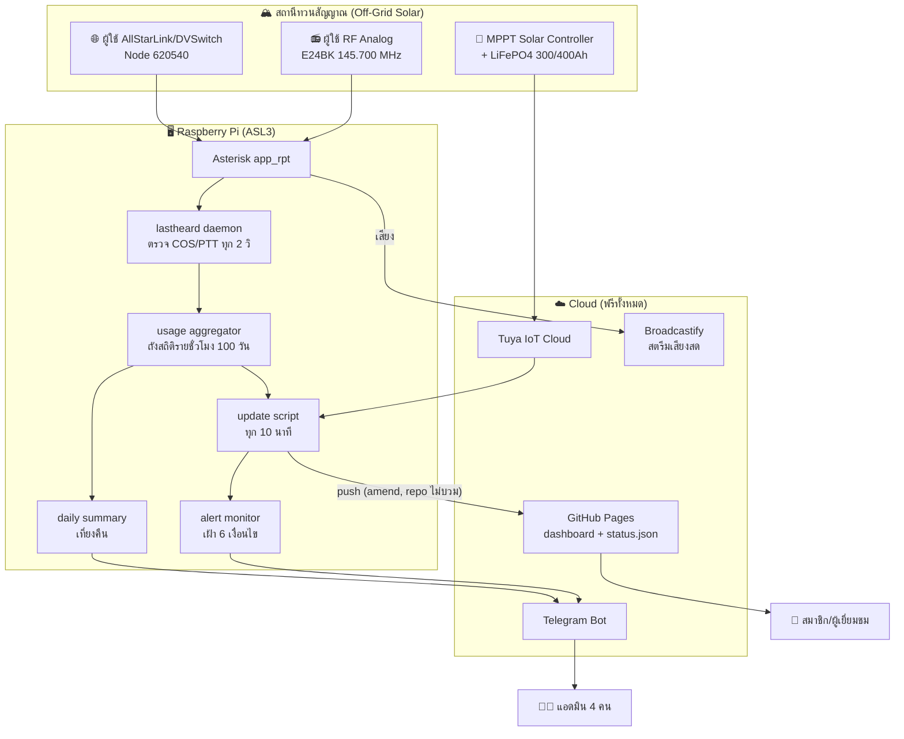

# 📡 HS8AC One-Stop Service Dashboard

**Dashboard อัจฉริยะของสมาคมวิทยุสมัครเล่นจังหวัดชุมพร (Chumphon Amateur Radio Society)**

🔴 **Live:** https://e25xld-ham.github.io/hs8ac/

ระบบเฝ้าสถานีทวนสัญญาณครบวงจร — สถิติการใช้ความถี่จริง, มอนิเตอร์พลังงานโซลาร์ด้วยเซ็นเซอร์ IoT, แจ้งเตือนเหตุผิดปกติเข้า Telegram — ทั้งหมดรันบน Raspberry Pi ตัวเดียว โฮสต์ฟรีบน GitHub Pages **ค่าใช้จ่ายรายเดือน 0 บาท**

---

## ✨ ฟีเจอร์

### 🛎️ One-Stop Service สำหรับสมาชิก
- ลงทะเบียนใช้งาน AllStarLink ของสมาคม (อนุมัติภายใน 1 ชั่วโมง)
- คู่มือการใช้งาน DVSWITCH Mobile ฉบับภาพประกอบ
- ต่ออายุบัตรสมาชิก/สอบถามผ่าน LINE Official Account
- ข้อมูลสมาคม: ประวัติ, คณะกรรมการบริหาร 20 ท่านพร้อม callsign, ความถี่สถานีทวน (E24BK Analog · E24GD D-STAR · APRS)

### 📊 On-Air Activity — สถิติการใช้ความถี่จากข้อมูลจริง
- ตัวเฝ้าบน Pi ตรวจจับ **ทุกการกดคีย์** ทุก 2 วินาที — แยกผู้ใช้ **RF analog (จาก COS)** กับ **AllStarLink (จาก link state)** โดยอัตโนมัติ
- แยก "คุยจริง" กับ "kerchunk" (กดเช็คสัญญาณ < 3 วินาที)
- Heatmap รายชั่วโมง 7 วัน · กราฟ airtime รายชั่วโมง/รายวัน 30 วัน · Last Heard · ชั่วโมงพีค
- Archive สถิติเป็น CSV รายเดือนอัตโนมัติ (เปิดใน Excel ได้) — [ดูตัวอย่าง](https://github.com/e25xld-ham/dvswitch-manual/tree/master/archive)

### ⚡ Power & Emergency Planning — สถานี Off-Grid 100%
- ผังพลังงานเคลื่อนไหว: ตู้ไฟ 220V + แบตลิเธียม 2 ชุด (300Ah/400Ah สลับเวรอัตโนมัติเที่ยงคืน) + เส้นจ่ายไฟแบบจุดวิ่งบอกทิศทางจริงตามเวลา
- **ค่าวัดจริงจากเซ็นเซอร์ IoT**: อ่าน MPPT Solar Charge Controller ผ่าน Tuya Cloud ทุก 10 นาที — แรงดันแบต, วัตต์ชาร์จ, อุณหภูมิ
- % แบตเทียบจากแรงดันจริง (LiFePO4 calibration) · เกจแบตเปลี่ยนสีเขียว/เหลือง/แดงกะพริบตามระดับ
- กราฟการกินไฟรายชั่วโมง + รายวัน 30 วัน แยกสีตามก้อนแบตที่รับเวร
- พื้นหลัง section เปลี่ยนกลางวัน/กลางคืนอัตโนมัติ

### 📶 สถานะระบบ AllStarLink
- สถานะ node 620540 + จำนวนผู้ใช้ที่ลงทะเบียน + node ที่เชื่อมต่อ (แยกผู้ใช้งานจริง / node ภายนอก)
- ปุ่มฟังสตรีมสดผ่าน Broadcastify + สถิติ node
- Last Heard 8 รายการล่าสุด + บันทึกการใช้ AllStar/RF ครั้งล่าสุดถาวร

### 🔔 ระบบแจ้งเตือนอัตโนมัติ (Telegram)
แจ้งแอดมินทุกคนทันทีเมื่อ: node ออฟไลน์ · แบตต่ำกว่า 12.8V · **กลางวันแต่โซลาร์ไม่ชาร์จ** (จับแผงเสียก่อนแบตหมด) · สตรีมเงียบ · เซ็นเซอร์หลุด · ระบบอัปเดตค้าง — พร้อมแจ้งซ้ำทุก 6 ชม. และแจ้ง "กลับมาปกติ" เมื่อเคลียร์

### 📬 สรุปประจำวันเข้า Telegram
ทุกเที่ยงคืน: ยอดกดคีย์ (แยก RF/AllStar/kerchunk), airtime รวม, ชั่วโมงคึกคักสุด, สถานีที่ใช้งาน — ส่งหาแอดมินทุกคนอัตโนมัติ

---

## 🏗️ สถาปัตยกรรม

## 🛡️ ความทนทาน (Disaster-Ready)

- **สถานี off-grid 100%** — โซลาร์+แบตล้วน ไม่พึ่งไฟฟ้าสาธารณะ
- ไฟดับ/reboot → ทุกบริการ (systemd + cron `@reboot`) ฟื้นเองครบ
- เน็ตหลุด → เก็บข้อมูลต่อ local, กลับมาเมื่อไหร่ sync ขึ้น GitHub เอง
- Pi/SD card พัง → backup อัตโนมัติรายสัปดาห์ + คู่มือกู้คืน กลับมาครบใน ~30 นาที
- GitHub ล่ม → หน้าเว็บ static ยังเสิร์ฟจาก CDN cache, ข้อมูลบน Pi ไม่หาย

## 🧰 Tech Stack

| ส่วน | เทคโนโลยี |
|---|---|
| Node/RF | AllStarLink 3 (Asterisk app_rpt), DVSwitch |
| Telemetry | Python 3 + Bash บน Raspberry Pi, systemd, cron |
| เซ็นเซอร์พลังงาน | Tuya Cloud API (tinytuya) → MPPT Solar Controller |
| หน้าเว็บ | HTML/CSS/JS ล้วน (ไม่มี framework) + SVG animation |
| โฮสติ้ง | GitHub Pages (static + `status.json` อัปเดตทุก 10 นาที) |
| แจ้งเตือน | Telegram Bot API |
| สตรีมเสียง | ezstream → Broadcastify |

## 👨‍🔧 เครดิต

พัฒนาระบบโดย **E25XLD** (also **KE9CYN**) ร่วมกับ [Claude Code](https://claude.com/claude-code)
สมาคมวิทยุสมัครเล่นจังหวัดชุมพร · HS8AC · *ช่วยชาติ ช่วยสังคม เราสุขใจ*

> 📻 นักวิทยุสมัครเล่น/สมาคมอื่นที่สนใจนำแนวทางนี้ไปใช้กับสถานีของท่าน ยินดีให้ศึกษาโค้ดหน้าเว็บใน repo นี้ได้เลยครับ 73!
