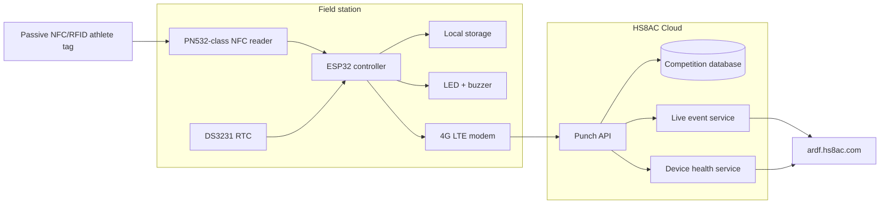
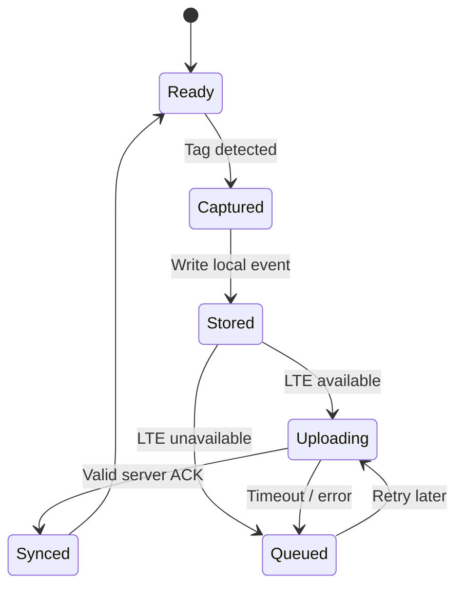

# System Architecture

## End-to-end topology



## Field station roles

All field modules use the same general hardware/firmware platform. Their behavior is determined by configuration.

```text
CP-START
CP-F01
CP-F02
CP-F03
CP-F04
CP-F05
CP-FINISH
```

This avoids maintaining seven unrelated firmware builds.

## Required punch lifecycle

A punch event is not considered safely captured until it exists in persistent local storage.

```text
1. Detect NFC tag
2. Read UID
3. Read RTC time
4. Create unique local event ID
5. Save event to persistent local storage
6. Confirm locally with LED/buzzer
7. Attempt upload
8. Validate server ACK
9. Mark local event as synchronized
```

If step 7 or 8 fails, the event remains queued.

## Offline behavior



The athlete should receive successful punch feedback after **local durable storage**, not after waiting for the Internet.

## Event identity

Each event should carry enough information to distinguish legitimate retransmission from duplicate athlete actions.

Suggested fields:

```text
event_id        UUID or device-based unique ID
competition_id  e.g. CHUMPHON_ARDF_2026
device_id       e.g. CP-F03
station_role    START / FOX / FINISH
station_number  0..5 where applicable
tag_uid         raw/normalized NFC UID
punch_time      local RTC timestamp
sequence        monotonic device sequence number
firmware        firmware version
battery         optional battery telemetry
rssi            LTE signal strength when upload occurs
signature       message authentication value
```

## Duplicate handling

There are two different duplicate cases and they should not be confused.

### Network retransmission

The same `event_id` may be uploaded several times because the field station did not receive an ACK. The server should store it once and return a valid ACK for repeated delivery.

### Athlete repeats a punch

The athlete may physically touch the same FOX several times. These are separate captures with separate event IDs. Competition rules can decide whether the first valid punch, last punch or another policy is used for scoring.

The raw event history should not be silently deleted.

## Time synchronization

Primary competition timing is based on the reader RTC at capture time.

Before a competition, all field modules must undergo a time synchronization/check procedure. Future revisions may use GNSS and/or network time as calibration sources, but an Internet connection at punch time must not be required.

## Security model

Each field device should have an independent secret/key. A compromised FOX credential should not automatically authorize another FOX.

Minimum server checks:

1. known competition ID
2. known device ID
3. valid message signature/authentication
4. valid field structure
5. plausible timestamp policy
6. event ID idempotency
7. sequence tracking / anomaly detection

Secrets must never be committed to the public GitHub repository.

## Cloud responsibilities

The cloud must not invent official field timestamps. Its responsibilities are:

- authenticated event ingestion
- durable storage
- deduplication/idempotency
- live result projection
- athlete progress calculation
- device health monitoring
- operator audit logs
- delayed/offline event reconciliation

## Live dashboard responsibilities

The officials' dashboard should distinguish between:

- live synchronized punches
- delayed punches received from offline queue
- device offline state
- pending/unknown device queue state
- invalid/rejected uploads

This prevents a temporary mobile-network failure from being confused with a missing athlete punch.
