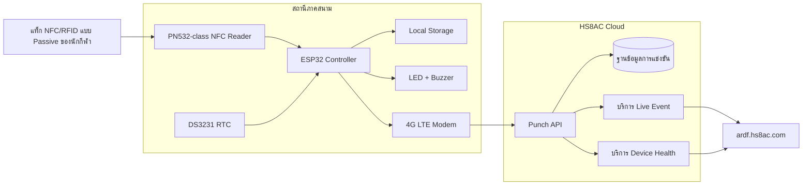
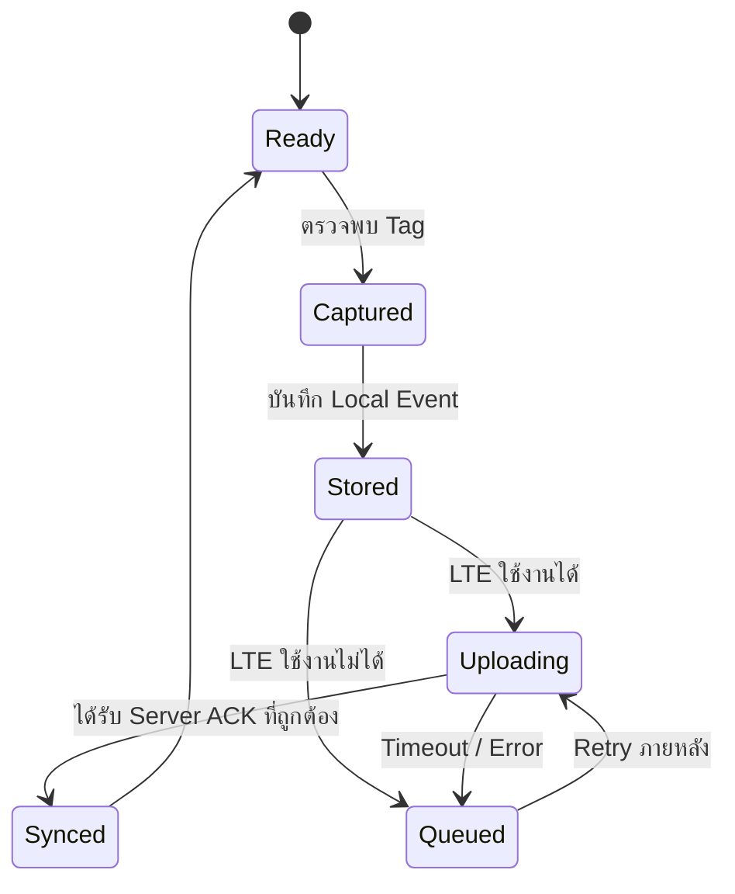

# สถาปัตยกรรมระบบ HS8AC ARDF ePunch

## ภาพรวมการเชื่อมต่อ End-to-End



## บทบาทของสถานีภาคสนาม

ทุกสถานีใช้แพลตฟอร์ม Hardware/Firmware หลักแบบเดียวกัน แล้วกำหนดบทบาทด้วย Configuration

```text
CP-START
CP-F01
CP-F02
CP-F03
CP-F04
CP-F05
CP-FINISH
```

แนวทางนี้ช่วยให้เราไม่ต้องดูแล Firmware แยกกันถึง 7 ชุด

## วงจรชีวิตของ Punch ที่ระบบต้องทำ

Punch จะยังไม่ถือว่าถูกเก็บอย่างปลอดภัยจนกว่าจะถูกเขียนลง Persistent Local Storage สำเร็จ

```text
1. ตรวจพบ NFC Tag
2. อ่าน UID
3. อ่านเวลาจาก RTC
4. สร้าง Event ID ที่ไม่ซ้ำ
5. บันทึก Event ลง Persistent Local Storage
6. แจ้งนักกีฬาด้วย LED/Buzzer
7. พยายาม Upload
8. ตรวจสอบ Server ACK
9. ทำเครื่องหมาย Local Event ว่า Sync แล้ว
```

ถ้าขั้นตอน 7 หรือ 8 ล้มเหลว Event ต้องคงอยู่ใน Queue เพื่อส่งใหม่ภายหลัง

## การทำงานเมื่อ Offline



นักกีฬาควรได้รับสัญญาณ Punch สำเร็จหลังจาก **บันทึกข้อมูลลง Local Storage แบบถาวรแล้ว** ไม่ใช่หลังจากรอ Internet ตอบกลับ

## ตัวตนของ Event

Event แต่ละรายการควรมีข้อมูลเพียงพอที่จะแยก Network Retransmission ออกจากการที่นักกีฬาแตะซ้ำจริง

แนะนำ Fields:

```text
event_id        UUID หรือ Unique ID ที่สร้างจาก Device
competition_id  เช่น CHUMPHON_ARDF_2026
device_id       เช่น CP-F03
station_role    START / FOX / FINISH
station_number  0..5 ตามความเหมาะสม
tag_uid         UID ของ NFC แบบ Raw/Normalized
punch_time      เวลา RTC ขณะอ่านแท็ก
sequence        Sequence Number ของ Device ที่เพิ่มขึ้นเรื่อย ๆ
firmware        เวอร์ชัน Firmware
battery         ค่า Battery Telemetry (ถ้ามี)
rssi            ความแรงสัญญาณ LTE ตอน Upload
signature       ค่าตรวจสอบความถูกต้องของข้อความ
```

## การจัดการข้อมูลซ้ำ

ข้อมูลซ้ำมี 2 กรณีที่ต้องแยกออกจากกัน

### Network Retransmission

`event_id` เดิมอาจถูก Upload หลายครั้ง เพราะ Reader ไม่ได้รับ ACK จาก Server ระบบ Server ต้องเก็บเพียงครั้งเดียว และตอบ ACK กลับอย่างถูกต้องแม้ได้รับข้อมูลเดิมซ้ำ

### นักกีฬา Punch ซ้ำ

นักกีฬาอาจแตะ FOX เดิมมากกว่าหนึ่งครั้ง การแตะแต่ละครั้งเป็นคนละ Capture และต้องมี Event ID แยกกัน กติกาการแข่งขันค่อยกำหนดว่าจะใช้ Punch แรก Punch ล่าสุด หรือ Policy อื่นในการคิดผล

Raw Event History ต้องไม่ถูกลบทิ้งแบบเงียบ ๆ

## การซิงก์เวลา

เวลาหลักของการแข่งขันอ้างอิง RTC ใน Reader ณ เวลาที่อ่าน Tag

ก่อนการแข่งขัน Reader ทุกเครื่องต้องผ่านขั้นตอนตรวจสอบและซิงก์เวลาให้ตรงกัน ในอนาคตอาจใช้ GNSS และ/หรือ Network Time เป็นแหล่ง Calibration เพิ่มเติม แต่การ Punch ต้องไม่จำเป็นต้องมี Internet ในขณะนั้น

## Security Model

Reader แต่ละเครื่องควรมี Secret/Key ของตัวเอง หาก Credential ของ FOX เครื่องหนึ่งรั่ว จะต้องไม่ทำให้สามารถปลอมตัวเป็น FOX เครื่องอื่นได้โดยอัตโนมัติ

Server ต้องตรวจอย่างน้อย:

1. Competition ID ที่รู้จัก
2. Device ID ที่รู้จัก
3. Message Signature/Authentication ถูกต้อง
4. โครงสร้าง Field ถูกต้อง
5. Timestamp ผ่าน Policy ที่กำหนด
6. Event ID รองรับ Idempotency
7. ติดตาม Sequence เพื่อค้นหาความผิดปกติ

**ห้ามนำ Secret หรือ Production Credential ใส่ไว้ใน Public GitHub Repository**

## หน้าที่ของ Cloud

Cloud ห้ามสร้างหรือแก้ Official Field Timestamp เอง หน้าที่หลักคือ:

- รับ Event ที่ผ่าน Authentication
- เก็บข้อมูลอย่างถาวร
- Deduplication / Idempotency
- สร้าง Live Result
- คำนวณความคืบหน้าของนักกีฬา
- ตรวจสุขภาพ Device
- เก็บ Operator Audit Log
- รวมและตรวจสอบ Event ที่ส่งย้อนหลังหลัง Offline

## หน้าที่ของ Live Dashboard

Dashboard สำหรับกรรมการควรแยกสถานะให้เห็นชัดระหว่าง:

- Punch ที่ Sync แบบสด
- Punch ที่ส่งย้อนหลังจาก Offline Queue
- Device ที่ Offline
- สถานะ Queue ที่ยังไม่ทราบหรือ Pending
- Upload ที่ไม่ถูกต้องหรือถูก Reject

การแยกสถานะเหล่านี้จะช่วยให้ปัญหาเครือข่ายมือถือชั่วคราวไม่ถูกเข้าใจผิดว่าเป็นการที่นักกีฬาพลาด Punch
